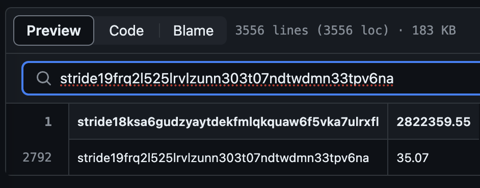

# Eligibility for Stride's stDYDX Airdrop
Holding stDYDX? You're likely eligible for Stride's stDYDX airdrop.

Every 14 days, snapshots of stride addresses eligible for the stDYDX airdrop will be uploaded to this repository.

Your balance will the sum of your stDYDX holdings across all days you held them. For example, if you held 1 stDYDX on day 1, and 2 stDYDX on day 2, your balance will be 3.

Questions? Read the full airdrop details [here](https://www.stride.zone/blog/airdrop-to-stdydx-holders) or contact Stride on [Twitter](https://twitter.com/stride_zone), [Discord](https://discord.com/invite/stride-zone) or [Telegram](https://t.me/stridezone_official).

## How to check my eligibility

1. Find your Stride address in the Keplr extension by clicking "Copy Address" 
2. Click on the `2.28.2024.csv` snapshot in this Github repo.
3. Paste your address in the `Search this file` field. You will see your score. For example, `stride19frq2l525lrvlzunn303t07ndtwdmn33tpv6na` has a score of 35.07: .

## What does the data mean?

The `2.28.2024.csv` snapshot contains two columns:
- The stride address of the user who held stDYDX at any point over the eligibility period
- The user's snapshot score as of Feb 28th, 2024
```
...
stride1ymf2j7krkd7xrxwu4v8t9p983lk092r9dwfpsy,201.4
stride1y8p7y33elud5232424znxhn7pnl2c82a8vk6kn,200.02
...
```

A user's snapshot score is calculated by snapshotting the user's stDYDX balance at a random time each eligibility day, then adding up these balances across the period. 

As an example:
```
balance on day 1: 2
balance on day 2: 1
balance on days 3: 4
balance on days 4+: 0
-
snapshot score = 6 (calculated as 2+1+4)
```

At the end of the 120-day airdrop period, STRD will be distsributed pro-rata across users corresponding accorinding to their scores.

Note: scores shown in this repo are not final and are subject to change to resolve any detected issues.